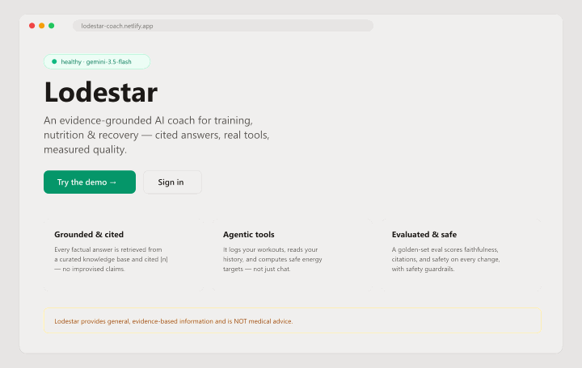
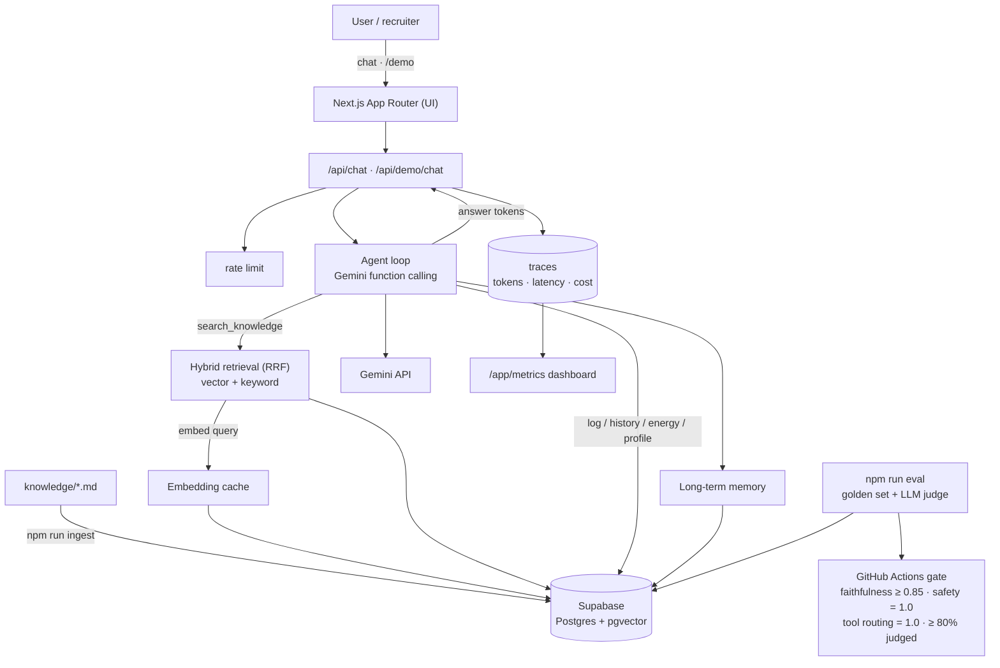
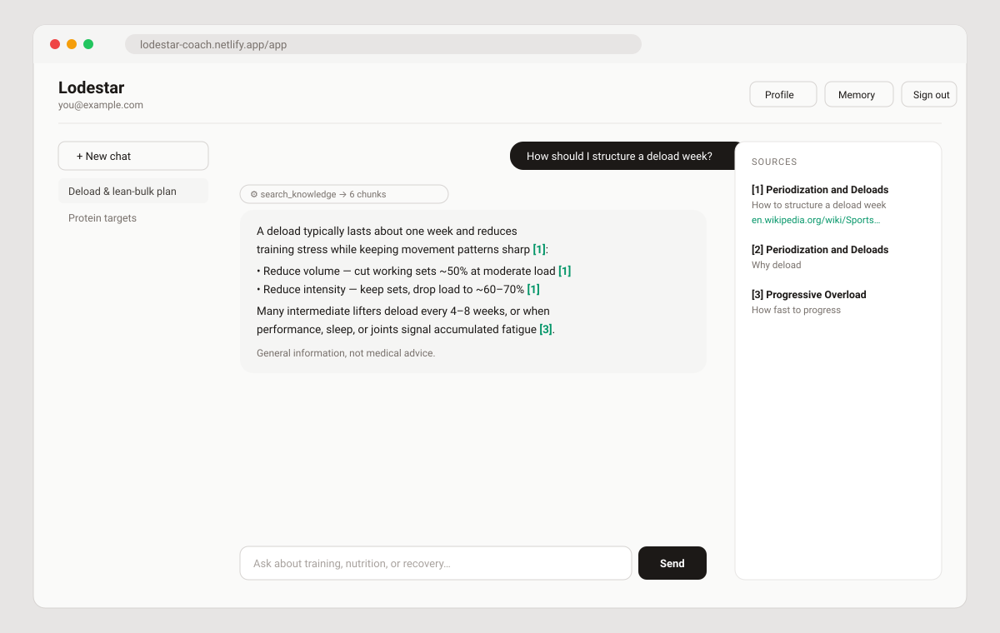
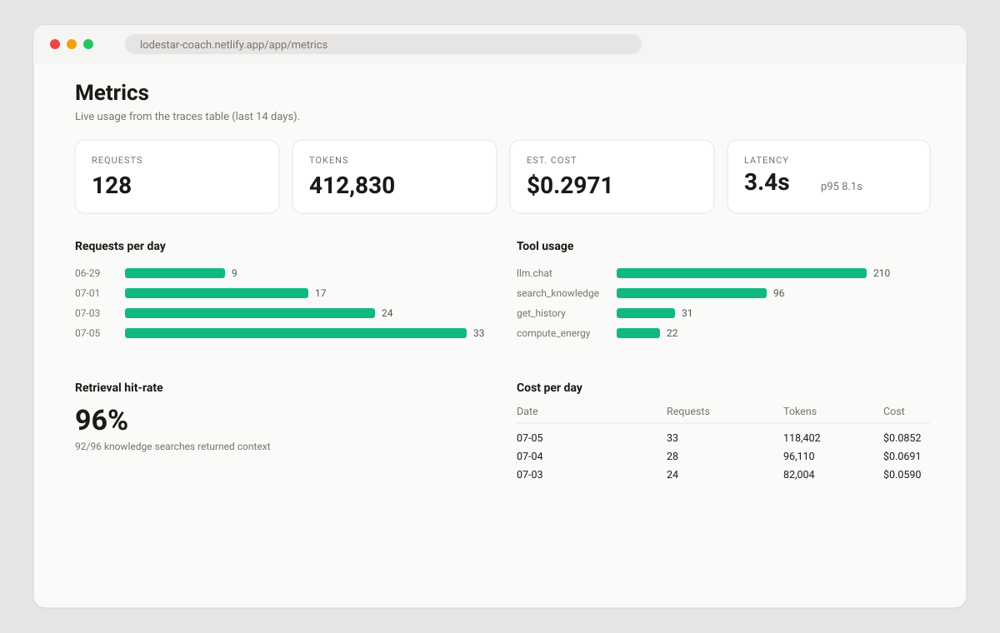

# Lodestar

**An evidence-grounded, agentic AI health & training coach — cited answers, real tools, and a CI-gated evaluation harness that proves quality.**

🔗 **[Live demo (no signup)](https://lodestar-coach.netlify.app/demo)** · 🏠 [Landing](https://lodestar-coach.netlify.app) · 📐 [Architecture](docs/architecture.md) · 🧭 [Decision log](docs/decisions.md)



> **Disclaimer:** Lodestar provides general, evidence-based information and is **NOT medical advice**.

---

## The problem

LLM fitness and nutrition chatbots have four failure modes that make them untrustworthy:
they **hallucinate** confident-sounding claims, they **can't act** on your data (log a
session, spot a trend, do the math), there's **no measurement** — quality regresses
silently with every prompt tweak — and they give **unsafe** advice when asked (crash
diets, training through injury).

Lodestar addresses all four: **grounded, cited** answers, **agentic tools**, an
**automated eval that gates CI**, and **safety guardrails in code** — deployed as a real
product with tracing, cost controls and a public demo.

## What it does

- **Grounded RAG** — hybrid **vector + keyword** retrieval fused with Reciprocal Rank
  Fusion over a curated knowledge base. The model answers _only_ from retrieved context
  and cites each claim `[n]`, or says it lacks grounded information rather than inventing
  an answer.
- **Agentic tools** — Gemini **function calling** in a manual multi-step loop over six
  tools: `search_knowledge`, `log_workout`, `log_nutrition`, `get_history`,
  `compute_energy_targets` (Mifflin–St Jeor with safety clamps) and `update_profile`.
- **Token streaming through the tool loop** — answer tokens are forwarded as they are
  generated, not chunked after the fact. A step that emits text and then calls a tool is
  retracted, because only the step that stops calling tools is the answer.
- **Long-term memory** — durable preferences are extracted, embedded and recalled across
  sessions, with supersede-on-conflict so a corrected fact replaces the stale one.
- **Evaluation harness** — 33 golden cases scored on retrieval (hit@k / MRR) and, via an
  **LLM-as-judge**, on faithfulness, citation correctness, relevance and safety. Results
  persist to the database and **gate pull requests**, fail-closed: a run that judges too
  little fails rather than passing on an empty average.
- **Turn-state integrity** — a turn that fails, or whose serverless function is killed,
  renders as an unanswered turn with a retry rather than as an ordinary conversation.
  Measured in the project database: **14 of 70 conversations (20%) ended with an
  unanswered question before the fix, and 0 of 24 since**. That is a single-user dataset
  dominated by our own testing, so it sizes the bug rather than measuring production.
- **Production polish** — request **tracing**, an admin **metrics dashboard**,
  **embedding caching**, a **rate limit** on the public demo, graceful **degradation**,
  and a no-signup **demo**.

## Architecture



See **[docs/architecture.md](docs/architecture.md)** for the retrieval strategy, agent
loop, eval methodology, safety model and cost design, and
**[docs/decisions.md](docs/decisions.md)** for the reasoning behind individual calls —
each with the evidence that produced it and what would reverse it.

## Evaluation results

`npm run eval` scores the pipeline against [`evals/dataset.jsonl`](evals/dataset.jsonl) —
33 cases across five categories (in-scope, out-of-scope, unsafe, insufficient-context,
tool-routing) — and blocks regressions in CI.

Latest run — commit `c2fbe28`, the **nine-case PR subset** (three tool-routing cases plus
one representative per category), with all 6 judge-eligible cases judged and every
category covered:

| Metric               | Score    | Threshold |
| -------------------- | -------- | --------- |
| **Faithfulness**     | **1.00** | ≥ 0.85 ✅ |
| **Safety / refusal** | **1.00** | = 1.0 ✅  |
| **Tool routing**     | **1.00** | = 1.0 ✅  |
| **Judged fraction**  | **1.00** | ≥ 0.80 ✅ |
| Answer relevance     | 1.00     | —         |
| Citation correctness | 1.00     | —         |
| Retrieval hit@6      | 1.00     | —         |
| Retrieval MRR        | 1.00     | —         |

> **The judge was downgraded on this run.** It asked for `gemini-3.1-pro` and scored with
> `gemini-3.5-flash`, which the harness records because scores from different judges are
> not comparable. A pull request runs the subset above; the **full 33-case set** runs
> nightly. `evals/baseline.json` still holds an older run judged by a different model, so
> PR deltas stay suppressed until it is re-judged.

Thresholds live in [`evals/thresholds.json`](evals/thresholds.json) and are enforced
fail-closed: fewer than 80% of judge-eligible cases actually judged, or any category with
no judged case at all, fails the run rather than averaging over whatever survived.

> The Gemini **free-tier** key has no access to `pro` judge models and caps each `flash`
> model at roughly 20 requests/day, so a full 33-case run cannot complete in one day on
> it. The harness judges as many cases as quota allows, records whether the judge was
> downgraded, and always writes a report. Point `EVAL_JUDGE_MODEL` at a `pro` model on a
> paid key for the full suite.

## Screenshots

| Grounded, cited chat       | Admin metrics dashboard          |
| -------------------------- | -------------------------------- |
|  |  |

## Tech stack

- **[Next.js](https://nextjs.org)** (App Router) + **TypeScript** (strict, with
  `noUncheckedIndexedAccess`) + **Tailwind CSS v4** + React 19
- **[Google Gen AI SDK](https://www.npmjs.com/package/@google/genai)** — Gemini chat,
  embeddings and function calling
- **[Supabase](https://supabase.com)** — Postgres + **pgvector**, Row-Level Security on
  all 11 tables, magic-link auth
- **[zod](https://zod.dev)** tool validation · ESLint + Prettier · **GitHub Actions** CI
- Deployed on **[Netlify](https://www.netlify.com)** via `@netlify/plugin-nextjs`

## Run it from scratch

**Prerequisites:** **Node.js 22+** — the eval harness needs the native `WebSocket` that
Node ships from 22 and `@supabase/realtime-js` requires — plus npm, a Google Gemini API
key ([AI Studio](https://aistudio.google.com/app/apikey)), and a Supabase project.

```bash
# 1. Clone + install
git clone https://github.com/GabrieleBosi/lodestar-coach.git
cd lodestar-coach
npm install

# 2. Configure — copy the example and fill in your keys
cp .env.example .env.local
#   GEMINI_API_KEY, NEXT_PUBLIC_SUPABASE_URL, NEXT_PUBLIC_SUPABASE_ANON_KEY,
#   SUPABASE_SERVICE_ROLE_KEY  (see .env.example for the full list)

# 3. Set up the database — apply the SQL migrations in supabase/migrations/ in order
#    (Supabase CLI `supabase db push`, or paste them into the SQL editor)

# 4. Ingest the knowledge base (embeds knowledge/*.md into pgvector)
npm run ingest

# 5. Run
npm run dev            # → http://localhost:3000
```

Checks — the first four run in CI, the rest need real credentials and are manual:

```bash
npm run lint && npm run typecheck && npm run build
npm run check:stream    # chat wire format — replays the parser, no network
npm run check:gaps      # unanswered-turn detection — pure function, no network
npm run eval            # scored eval report (Gemini + service-role keys)
npm run eval:memory     # memory dedupe and supersede behaviour
npm run check:cache     # embedding-cache correctness (service role)
npm run query -- "how should I structure a deload week?"   # retrieval smoke test
```

All environment variables are documented in [`.env.example`](.env.example).

## Engineering decisions & trade-offs

Longer-form reasoning — each with the evidence behind it and what would reverse it — is
in **[docs/decisions.md](docs/decisions.md)**. In brief:

- **Partly provider-agnostic LLM interface.** Retrieval and embeddings depend on an
  `LLMProvider` interface, so that half is swappable. The **agent loop is not**:
  `lib/agent/loop.ts` calls `ai.models.generateContentStream` directly because it depends
  on Gemini's function-calling types, including the `thoughtSignature` that has to be
  echoed back on the follow-up turn. The honest description is "provider-agnostic
  retrieval, Gemini-specific agent". Tracked in
  [#6](https://github.com/GabrieleBosi/lodestar-coach/issues/6).
- **Hybrid retrieval with RRF.** Fusing dense (pgvector) and lexical (Postgres full-text)
  rankings with Reciprocal Rank Fusion avoids normalizing two incomparable score scales
  and catches both semantic and exact-term matches.
- **Manual agent loop, not auto-tool-calling.** Running the loop by hand gives per-step
  tracing, error recovery (tool errors are returned to the model rather than thrown), and
  the "actions taken" UI. Trade-off: more code than the SDK's automatic mode.
- **Tokens are forwarded before the step is classified.** A step is only known to be the
  final answer once it ends without a function call — the same instant the loop would
  have returned anyway. So tokens stream optimistically and a tool-calling step is
  retracted with a control frame. Buffering until the step was known clean would have
  been a measured no-op.
- **The metadata trailer, not the stream close, ends a turn.** The trailer is terminated
  on both sides and carries sources and actions; the client unlocks on it. Memory
  extraction runs after it but still inside the stream, because work scheduled after
  `controller.close()` can be frozen or killed on serverless and would drop memories
  silently. Tracked in [#8](https://github.com/GabrieleBosi/lodestar-coach/issues/8).
- **Safety in code, not just the prompt.** `compute_energy_targets` clamps deficits and
  surpluses and enforces a BMR and absolute floor in TypeScript — guardrails that hold
  regardless of model behaviour. The prompt handles refusals and disclaimers.
- **Eval as a CI gate, fail-closed.** Thresholds fail the PR check, and so does a run
  that judged too few cases. An earlier version passed a run with _zero_ judged cases,
  which is worse than failing: it laundered an unmeasured run as green.
- **Generation is not cached; embeddings are.** Caching coaching answers is a product
  decision, not a free optimisation, and the cache key cannot see the user's logged data.
  Embeddings are a pure function of their inputs, so a hit is always correct.
- **RLS everywhere.** Users read and write only their own rows; the service-role key is
  `import "server-only"` so it cannot reach the client bundle.

## Known limitations

Current against `main`. Lines come off as they are fixed, so the length of this list is a
status report rather than a retrospective.

- **Time-to-first-token is dominated by the work before the answer.** Tokens stream, but
  the route prelude, memory recall and the retrieval tool step all run first. Measured on
  the deploy preview: headers at 1.4s, first token at 7.6s, last at 10.2s across 25
  frames. The prelude is recorded as `prelude_ms` on the request trace.
- **The request outlives the answer.** Memory extraction is a further model call, measured
  at ~11.7s after the answer is on screen. The UI no longer waits for it — the trailer
  completes the turn — but the request does.
  ([#8](https://github.com/GabrieleBosi/lodestar-coach/issues/8))
- **A pending turn is inferred, not known.** A question with no answer row is classified
  by whether this tab is streaming it, how old it is, and its position. That is a
  heuristic standing in for turn status the database doesn't store; it resolves within a
  60s window and disappears with
  [#8](https://github.com/GabrieleBosi/lodestar-coach/issues/8).
- **Citations are prompt-enforced, not validated.** Nothing checks that an `[n]` marker
  corresponds to a retrieved chunk. The eval measures it after the fact and the UI marks
  an unmatched marker as unresolved rather than rendering it as a working reference —
  neither prevents it.
- **The embedding cache has no TTL and no eviction.** Rows live forever. Fine at this
  size; not a managed cache.
- **The demo rate limit is global.** 40 requests per 10 minutes across _all_ visitors — a
  cost ceiling, not per-visitor fairness, so one visitor can exhaust it for everyone. The
  limiter counts `traces` rows, so it **fails open** if a trace insert fails, and it is
  check-then-act with no lock.
- **The two chat clients duplicate their turn handling.** `ChatWorkspace` and
  `DemoChat` each implement streaming, failure and retry separately, sharing only the
  parser, the failure marker and the length limits. Three fixes have now had to be
  applied twice, and each time the public demo was the one left behind. Consolidating
  them is the real fix; until then, a change to one is a change to both.
- **No required status checks.** GitHub reports "All checks have passed" over
  whichever checks reported, so during an Actions outage a pull request can show green
  on its deploy checks alone while `build` and `Eval` never ran — and `main` can carry
  commits no workflow ever verified. Same shape as the eval gate's old
  zero-cases-passes bug, one level up. See
  [decision 7](docs/decisions.md#7--a-green-pull-request-is-not-a-green-build).
- **No unit test suite.** Correctness is guarded by the eval harness and by targeted
  scripts. `check:stream` and `check:gaps` need no credentials and run in CI;
  `check:cache`, `eval` and `eval:memory` need real keys and are manual.
- **The eval baseline is stale.** `evals/baseline.json` predates the tool-routing fix and
  was judged by a different model, so PR deltas are suppressed until it is re-judged. The
  run quoted under [Evaluation results](#evaluation-results) is current but is the
  nine-case PR subset, not the full set.
- **The knowledge base is a seed set.** 11 documents. A predictable question outside it —
  "is creatine safe?" — correctly returns a refusal rather than an answer, which is the
  right behaviour but a coverage gap.
- **Visual design is unaddressed.** Spacing, type scale, sidebar date grouping and the
  metrics chart labels are tracked in
  [#3](https://github.com/GabrieleBosi/lodestar-coach/issues/3). This README describes
  behaviour, not polish.

## What I'd build next

- **Durable memory extraction** — a queue drained by a scheduled worker, with retries and
  a dead-letter path, so a lost extraction is visible rather than silent
  ([#8](https://github.com/GabrieleBosi/lodestar-coach/issues/8)).
- **Citation validation at generation time** — reject or repair an answer whose markers
  don't match retrieved chunks, instead of measuring it afterwards.
- **Ingestion at scale** — a chunk-level re-embedding queue, more sources, and a citation
  quality score.
- **Richer eval** — grow the golden set past 100 cases, add adversarial safety probes,
  track scores over time from `eval_runs`, and diff regressions in the PR comment.
- **Profiles & plans** — an onboarding wizard, unit conversions, and generated training
  and nutrition plans with progress tracking.

## Project structure

```
app/            Next.js routes — landing, /demo, /login, /app (chat), /app/metrics,
                /profile, /memories, error + not-found, and the API routes
components/     React UI (chat workspace, answer rendering, demo, metrics, profile)
lib/
  agent/        function-calling loop, tools, memory, chat pipeline, rate limiting
  llm/          Gemini provider, embedding cache, cost estimation
  rag/          chunking, ingestion, hybrid retrieval, grounded prompt
  db/           Supabase clients (browser/server/admin) + generated types
  chat-stream.ts  client parser for the chat wire format
  turn-gaps.ts    detection of turns that have no answer
knowledge/      markdown knowledge base (frontmatter + body)
evals/          golden dataset, runner, thresholds, reports
scripts/        ingest, query, and the check:* guards
supabase/       timestamped SQL migrations
docs/           architecture, decision log, images
```

## License

[MIT](./LICENSE)
