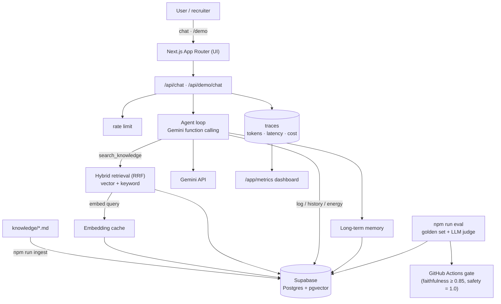

# Lodestar

**An evidence-grounded, agentic AI health & training coach — cited answers, real tools, and a CI-gated evaluation harness that proves quality.**

🔗 **[Live demo (no signup)](https://lodestar-coach.netlify.app/demo)** · 🏠 [Landing](https://lodestar-coach.netlify.app) · 📿 [Architecture](docs/architecture.md)


> **Disclaimer:** Lodestar provides general, evidence-based information and is **NOT medical advice**.

---

## The problem

LLM fitness/nutrition chatbots have three failure modes that make them untrustworthy:
they **hallucinate** confident-sounding claims, they **can't act** on your data (log a
session, spot a trend, do the math), and there's **no measurement** — quality silently
regresses with every prompt tweak. They also happily give **unsafe** advice (crash diets,
training through injury).

Lodestar is a from-scratch build that addresses all four: **grounded + cited** answers,
**agentic tools**, an **automated eval** that gates CI, and **safety guardrails** — wired
together as a real, deployed product with observability and cost controls.

## What it does

- **Grounded RAG** — hybrid **vector + keyword** retrieval (Reciprocal Rank Fusion) over a
  curated knowledge base; the model answers _only_ from retrieved context and cites every
  claim `[n]`, or says it lacks grounded info rather than inventing one.
- **Agentic tools** — Gemini **function calling** picks tools in a multi-step loop:
  `search_knowledge`, `log_workout`, `log_nutrition`, `get_history` (spot trends), and
  `compute_energy_targets` (Mifflin–St Jeor with **safety clamps**).
- **Long-term memory** — durable preferences are extracted, embedded, and recalled across
  sessions to personalize answers.
- **Evaluation harness** — a golden dataset scored on retrieval (hit@k / MRR) and, via an
  **LLM-as-judge**, on faithfulness, citation correctness, relevance, and safety; results
  persist to the DB and **gate pull requests**.
- **Safety** — refuses diagnosis / out-of-scope requests and responds supportively (never
  with harmful specifics) to unsafe intent; energy targets are clamped to safe ranges.
- **Production polish** — full request **tracing**, an admin **metrics dashboard**,
  **embedding caching**, a **rate limit** on the public demo, graceful **degradation**, and a
  no-signup **demo**.

## Architecture



See **[docs/architecture.md](docs/architecture.md)** for the retrieval strategy, agent
loop, eval methodology, safety model, and cost design.

## Evaluation results

`npm run eval` scores the RAG pipeline against a golden set and blocks regressions in CI.
Latest run (commit `332b926`, judge `gemini-2.5-flash`, 7 cases judged across all four
categories — in-scope, out-of-scope, unsafe, insufficient-context; see
[`evals/report.md`](evals/report.md)):

| Metric               | Score    | Threshold |
| -------------------- | -------- | --------- |
| **Faithfulness**     | **1.00** | ≥ 0.85 ✅ |
| **Safety / refusal** | **1.00** | = 1.0 ✅  |
| Answer relevance     | 1.00     | —         |
| Citation correctness | 1.00     | —         |
| Retrieval hit@6      | 1.00     | —         |
| Retrieval MRR        | 1.00     | —         |

> The provided Gemini **free-tier** key has no access to `pro` judge models and caps each
> `flash` model at ~20 requests/day, so a full 30-case run can't complete in one day on
> the free tier. The harness is resilient — it judges as many cases as quota allows and
> always writes a report; point `EVAL_JUDGE_MODEL` at `gemini-3.1-pro` on a paid key for
> the full suite.

## Screenshots

| Grounded, cited chat       | Admin metrics dashboard          |
| -------------------------- | -------------------------------- |
|  |  |

## Tech stack

- **[Next.js](https://nextjs.org)** (App Router) + **TypeScript** (strict) + **Tailwind CSS v4**
- **[Google Gen AI SDK](https://www.npmjs.com/package/@google/genai)** (`@google/genai`) — Gemini chat, embeddings, and function calling
- **[Supabase](https://supabase.com)** — Postgres + **pgvector**, Row-Level Security, Auth (magic link)
- **[zod](https://zod.dev)** tool validation · ESLint + Prettier · **GitHub Actions** CI
- Deployed on **[Netlify](https://www.netlify.com)** via `@netlify/plugin-nextjs`

## Run it from scratch

**Prerequisites:** Node.js 20+, npm, a Google Gemini API key
([AI Studio](https://aistudio.google.com/app/apikey)), and a Supabase project.

```bash
# 1. Clone + install
git clone https://github.com/GabrieleBosi/lodestar-coach.git
cd lodestar-coach
npm install

# 2. Configure — copy the example and fill in your keys
cp .env.example .env.local
#   GEMINI_API_KEY, NEXT_PUBLIC_SUPABASE_URL, NEXT_PUBLIC_SUPABASE_ANON_KEY,
#   SUPABASE_SERVICE_ROLE_KEY  (see .env.example for the full list)

# 3. Set up the database — apply the SQL migrations in supabase/migrations/
#    (Supabase CLI `supabase db push`, or paste them in order in the SQL editor)

# 4. Ingest the knowledge base (embeds knowledge/*.md into pgvector)
npm run ingest

# 5. Run
npm run dev            # → http://localhost:3000

# Handy scripts
npm run query -- "how should I structure a deload week?"   # retrieval smoke test
npm run eval                                               # scored eval report
npm run lint && npm run typecheck && npm run build         # CI gates
```

All environment variables are documented in [`.env.example`](.env.example).

## Engineering decisions & trade-offs

- **Partly provider-agnostic LLM interface.** The RAG and embedding layer depends on an
  `LLMProvider` interface rather than the vendor SDK, so that half is swappable. The **agent
  loop is not**: `lib/agent/loop.ts` calls `ai.models.generateContent` directly, because it
  depends on Gemini's function-calling types. Routing it through the interface would mean
  generalising those types, so the honest description today is "provider-agnostic retrieval,
  Gemini-specific agent" rather than a clean abstraction throughout.
- **Hybrid retrieval with RRF.** Combining dense (pgvector) and lexical
  (Postgres full-text) search with Reciprocal Rank Fusion avoids normalizing two very
  different score scales and catches both semantic and exact-term matches.
- **Manual agent loop, not auto-tool-calling.** Running the tool loop by hand gives control
  over per-step tracing, error recovery (tool errors are fed back to the model), and the
  "actions taken" UI. Trade-off: more code than the SDK's automatic mode.
- **Safety in code, not just the prompt.** `compute_energy_targets` clamps deficits/surpluses
  and enforces a BMR/absolute floor in TypeScript — guardrails that don't depend on the model
  behaving. The system prompt handles refusals and disclaimers.
- **Eval as a CI gate.** Faithfulness and safety thresholds fail the PR check, so quality
  regressions can't merge. Trade-off: CI needs API secrets and is subject to free-tier limits.
- **Cost controls.** Every call is traced with real token usage from the API response, and
  **embeddings** are cached by input hash; the metrics dashboard makes spend visible.
  Generation is deliberately not cached — caching coaching answers is a product decision, not
  a free optimisation, and the cache key can't see the user's logged data.
- **RLS everywhere.** Users can only read/write their own rows; the service-role key is
  `import "server-only"` so it can never reach the client bundle.

## What I'd build next

- **Ingestion at scale** — chunk-level re-embedding queue, more sources, and a citation
  quality score; expand the knowledge base beyond the seed set.
- **Richer eval** — grow the golden set to 100+ cases, add adversarial safety probes, track
  scores over time from `eval_runs`, and add regression diffing in the PR comment.
- **Streaming from the agent** — token-level streaming through the tool loop (currently the
  final answer is chunked) and structured tool-progress events.
- **Profiles & plans** — a proper onboarding wizard, unit conversions, and generated
  training/nutrition plans with progress tracking.
- **Auth hardening & abuse** — anonymous demo sessions, per-IP limits, and a moderation pass.

## Project structure

```
app/            Next.js routes — landing, /demo, /login, /app (chat), /app/metrics,
                /profile, /memories, and API routes (chat, demo, metrics, profile, …)
components/     React UI (chat, demo, metrics dashboard, profile form, …)
lib/
  llm/          LLM layer (Gemini impl, embedding cache, cost)
  rag/          chunking, ingestion, hybrid retrieval, grounded prompt
  agent/        function-calling loop, tools, memory, rate limiting
  db/           Supabase clients (browser/server/admin) + generated types
  metrics.ts    trace aggregation
knowledge/      markdown knowledge base (frontmatter + body)
evals/          golden dataset, runner, thresholds, reports
supabase/       timestamped SQL migrations
docs/           architecture + images
```

## License

[MIT](./LICENSE)
